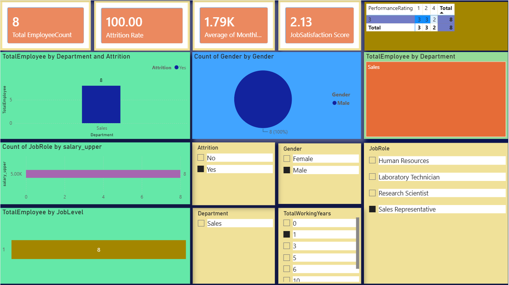

# 📊 HR Data Analysis — Python | SQL | Power BI



> An end-to-end HR data analysis project covering data cleaning, SQL-based querying, and interactive Power BI dashboarding — built to uncover actionable workforce insights.

---

## 📁 Repository Structure

```
HR-Data-Analysis-Python-SQL-PowerBI/
│
├── Dataset/                  # Raw and cleaned HR dataset (sourced from Kaggle)
├── Python Analysis/          # Jupyter Notebook for data cleaning & EDA
├── SQL Queries/              # SQL scripts for data analysis
├── PowerBI Dashboard/        # Power BI (.pbix) dashboard file
├── Screenshots/              # Dashboard screenshots
└── README.md
```

---

## 📌 Project Overview

Human Resources data holds a wealth of information about workforce trends, employee satisfaction, attrition, and performance. This project performs a comprehensive analysis of an HR dataset sourced from **Kaggle**, following a structured pipeline:

1. **Data Cleaning** with Python
2. **Exploratory & Structured Analysis** with SQL
3. **Interactive Visualization** with Power BI Desktop

The goal is to derive meaningful insights that can help HR teams make data-driven decisions around employee retention, performance management, and workforce planning.

---

## 🎯 Objectives

- Clean and prepare raw HR data for analysis
- Perform exploratory data analysis (EDA) to identify patterns and outliers
- Write SQL queries to answer key business questions
- Build an interactive Power BI dashboard for stakeholder reporting

---

## 🗃️ Data Source

- **Platform:** [Kaggle](https://www.kaggle.com/)
- **Dataset:** HR Employee Attrition & Performance dataset
- **Key Columns Include:** Employee ID, Age, Department, Job Role, Monthly Income, Attrition, Years at Company, Job Satisfaction, Performance Rating, and more

---

## 🛠️ Technologies Used

| Tool / Technology | Purpose |
|---|---|
| 🐍 **Python (Pandas, NumPy, Matplotlib, Seaborn)** | Data cleaning, preprocessing & EDA |
| 🗄️ **SQL** | Data querying and analysis |
| 📊 **Power BI Desktop** | Interactive dashboard creation |
| 📓 **Jupyter Notebook** | Python development environment |
| 🗂️ **Kaggle** | Data source |

---

## 🐍 Step 1 — Data Cleaning with Python

The raw dataset was loaded and cleaned using **Pandas** in a Jupyter Notebook. Key steps included:

- Handling missing and null values
- Removing duplicate records
- Fixing inconsistent data types (e.g., converting categorical columns)
- Renaming columns for clarity
- Feature validation and basic statistical exploration
- Exporting the cleaned dataset for SQL analysis

📂 **File:** `Python Analysis/HR_Data_Cleaning.ipynb`

---

## 🗄️ Step 2 — Data Analysis with SQL

The cleaned dataset was imported into a SQL database and queried to answer key HR business questions, such as:

- What is the overall employee attrition rate?
- Which departments have the highest turnover?
- How does monthly income vary across job roles?
- What is the distribution of employees by age group and gender?
- How do job satisfaction scores correlate with attrition?
- Which factors most strongly predict employee churn?

📂 **File:** `SQL Queries/HR_Analysis_Queries.sql`

---

## 📊 Step 3 — Power BI Dashboard

An interactive dashboard was built in **Power BI Desktop** to visualize the key findings. The dashboard includes:

- **KPI Cards** — Total Employees, Attrition Rate, Average Age, Average Monthly Income
- **Attrition by Department** — Bar chart breakdown
- **Attrition by Age Group & Gender** — Demographic analysis
- **Job Satisfaction vs. Attrition** — Correlation matrix
- **Monthly Income Distribution** — Box/bar plots by job role
- **Tenure Analysis** — Years at company vs. attrition
- **Interactive Slicers** — Filter by Department, Gender, Job Role, and Education Field

📂 **File:** `PowerBI Dashboard/HR_Dashboard.pbix`

---

## 💡 Key Insights & Conclusions

Based on the analysis, the following conclusions were drawn:

- 📉 **High Attrition Departments:** Sales and HR departments showed the highest attrition rates compared to Research & Development.
- 💰 **Income & Attrition Correlation:** Employees with lower monthly incomes were significantly more likely to leave the organization.
- 🕐 **Early Tenure Risk:** Employees in their first 1–3 years showed the highest risk of attrition, highlighting the importance of strong onboarding and early engagement programs.
- 😔 **Job Satisfaction Impact:** Employees reporting low job satisfaction scores (1–2 out of 4) had a disproportionately high attrition rate.
- 🧑‍💼 **Role-Specific Trends:** Sales Representatives and Lab Technicians recorded the highest turnover among all job roles.
- 🎓 **Education & Retention:** Employees with higher education levels (Masters/PhD) tended to have longer tenures on average.

---

## 🚀 How to Explore This Project

1. **Clone the repository:**
   ```bash
   git clone https://github.com/Rajaneeshkumar-code/HR-Data-Analysis-Python-SQL-PowerBI.git
   ```

2. **Run the Python notebook:**
   - Open `Python Analysis/HR_Data_Cleaning.ipynb` in Jupyter Notebook or VS Code
   - Install dependencies: `pip install pandas numpy matplotlib seaborn`

3. **Explore SQL queries:**
   - Import the cleaned dataset into any SQL environment (MySQL / PostgreSQL / SQLite)
   - Run scripts from `SQL Queries/`

4. **Open the dashboard:**
   - Open `PowerBI Dashboard/HR_Dashboard.pbix` in Power BI Desktop (free download from Microsoft)

---

## 📬 Connect with Me

- **GitHub:** [Rajaneeshkumar-code](https://github.com/Rajaneeshkumar-code)

---

> ⭐ If you found this project useful, consider giving it a star — it helps others discover it!
